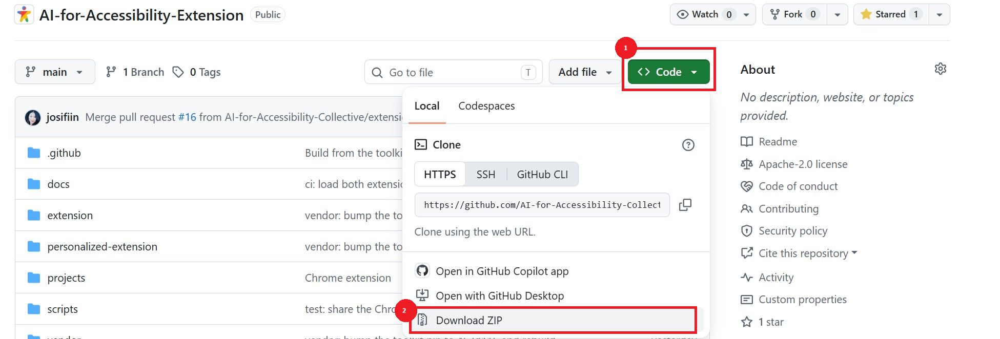
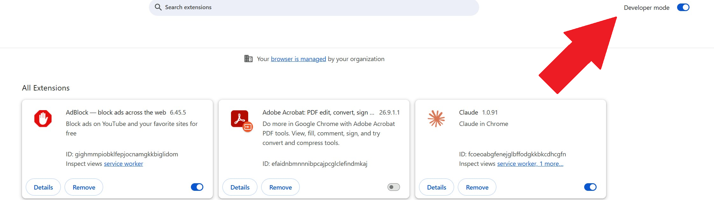
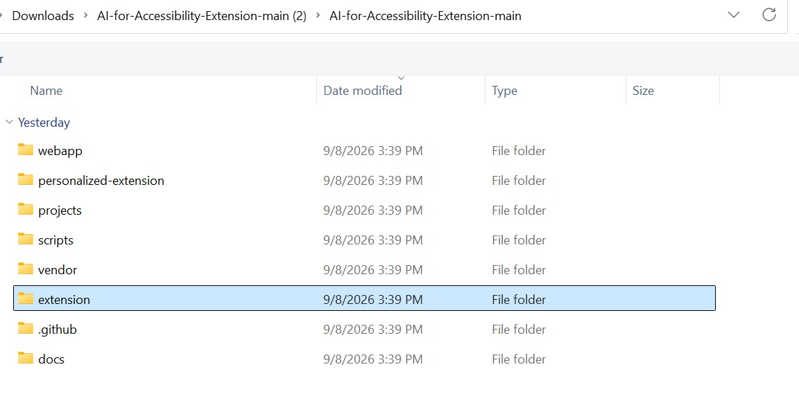
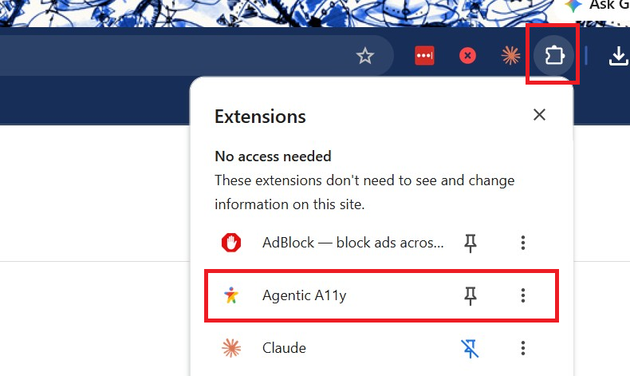
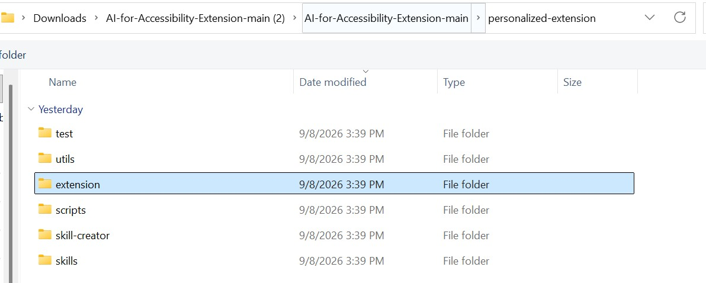
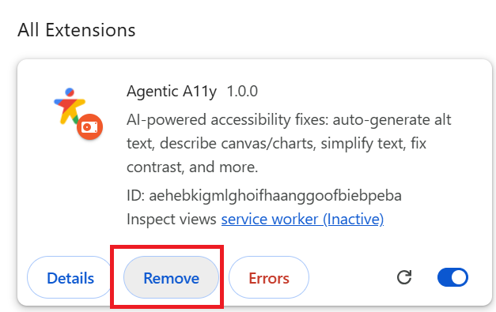

# Getting started — a guide for people, not programmers

This guide walks you through trying the AI for Accessibility extension,
start to finish, assuming you have never used GitHub or installed an
extension from a folder before. It covers the same steps as the main
README, in greater detail.

First, please note: **this is a research project, not a finished
product.** It is an early test version. Things may break or change, and
we haven't yet formally tested how well the page fixes work for any
particular person. Keep using the assistive technology you rely on — this
adds to it; it does not replace it.

## What you need

- A **computer** — Windows, Mac, or Linux. Not a phone or tablet.
- **Google Chrome**, reasonably up to date (version 120 or newer for the
  personalized extension's custom adapters).
- About **ten minutes**.
- Optional, only for the AI features: a **Google account**.

## What you get

Two extensions live in this project. Start with the first.

- **The original extension** — pick a profile (like Low Vision or
  Dyslexia) and pages change to match: bigger text, dark mode, calmer
  motion, decluttered reading, and more. Simple and predictable.
- **The personalized extension** — asks about your needs in your own
  words, learns from what you change, suggests things, and can build new
  page fixes for you. More powerful, more experimental.

## Installing the original extension

1. **Download the project.** On the project's GitHub page, select the
   green **Code** button near the top, then **Download ZIP**.

   
2. **Unpack it.** Open your Downloads folder and double-click the ZIP
   file. You get a folder named `AI-for-Accessibility-Extension-main`.
3. **Open Chrome's extensions page.** In Chrome, click into the address
   bar (the box where web addresses go), type `chrome://extensions`, and
   press Enter.
4. **Turn on Developer mode.** Use the switch in the top-right corner.
   This is a normal Chrome setting that allows installing extensions from
   a folder instead of the Chrome Web Store. It is allowed and
   reversible. Chrome may occasionally remind you that a developer-mode
   extension is running — that reminder is expected.

   
5. **Load it.** Select **Load unpacked**. In the file window that opens,
   open the `AI-for-Accessibility-Extension-main` folder, click once on
   the folder inside it named `extension`, and confirm.

   

   - If Chrome complains that a **manifest** is missing, you picked the
     wrong folder — open it and pick the `extension` folder inside.
6. **See it work.** A new icon appears to the right of the address bar
   (you may need to click the puzzle-piece icon to find and pin it).

   

   Open
   a news article — any longer written page — click the icon, and choose
   **Low Vision**. The page should change right away: bigger text, more
   spacing. That's success. Choose **Reset** or toggle the profile off to
   put the page back.

## The AI features, and the key they need

Everything above works with no account and no cost. Some features ask an
AI to write something new — describing pictures, captioning videos,
rewriting complicated text more simply, translating. Those need a
**Gemini API key**: a password-like code from Google that lets the
extension use Google's AI as you.

Whether and what this costs, and how to get and enter the key, has its
own plain-language page: [COSTS.md](COSTS.md). The short version: Google
gives everyone a free daily allowance, and many people stay inside it.

## Is my information safe?

The short version: what the extension learns about you stays on your
computer; page content goes to Google's AI only when you use an AI
feature with your own key; nothing is sold or sent to advertisers. The
full plain-language answer is [DATA-AND-PRIVACY.md](DATA-AND-PRIVACY.md),
and the honest what-could-go-wrong list is
[WHAT-TO-EXPECT.md](WHAT-TO-EXPECT.md) — worth five minutes before you
rely on anything here.

## Trying the personalized extension

Ready for the experimental one? Repeat the Load-unpacked steps, but in
step 5 choose the folder `personalized-extension`, then `extension`
inside it.

Keep Developer mode on — the custom page fixes it builds for
you only run while it is. In newer versions of Chrome (138 and later)
there is one more switch: on the extension's **Details** page at
`chrome://extensions`, turn on **Allow User Scripts**.

It starts with onboarding: describe your needs in your own words, pick
what sounds useful, and go. It suggests; you decide. Nothing about your
profile changes without your yes.

## Updating

A folder install does not update itself. When a new version is announced,
download the ZIP again, replace your old folder with the new one, and
click the refresh arrow on the extension's card at `chrome://extensions`.

## Removing it, completely

1. Type `chrome://extensions` in the address bar and press Enter.
2. On the extension's card, select **Remove** and confirm.

   

That deletes what it stored on this computer, including everything it
learned about you. If you entered an API key and want it gone from
Google's side too, delete the key at
[Google AI Studio](https://aistudio.google.com/apikey).

## When something goes wrong

The most common problems, in order:

1. **Chrome said "manifest missing".** You picked the outer folder during
   Load unpacked — pick the `extension` folder inside it.
2. **The icon does nothing / the page doesn't change.** Reload the
   extension (refresh arrow on its card), then reload the page. Some
   pages (Chrome's own pages, the Chrome Web Store) don't allow
   extensions at all; try a news article.
3. **AI features say the key is missing or over the limit.** See
   [COSTS.md](COSTS.md); the free allowance resets daily.
4. **Everything else:** [TROUBLESHOOTING.md](TROUBLESHOOTING.md) (its
   later sections are written for developers — that's normal, stop where
   it stops making sense), or open an issue on the repository telling us
   what you clicked and what you saw. If GitHub itself is the barrier,
   we want to know that too.
